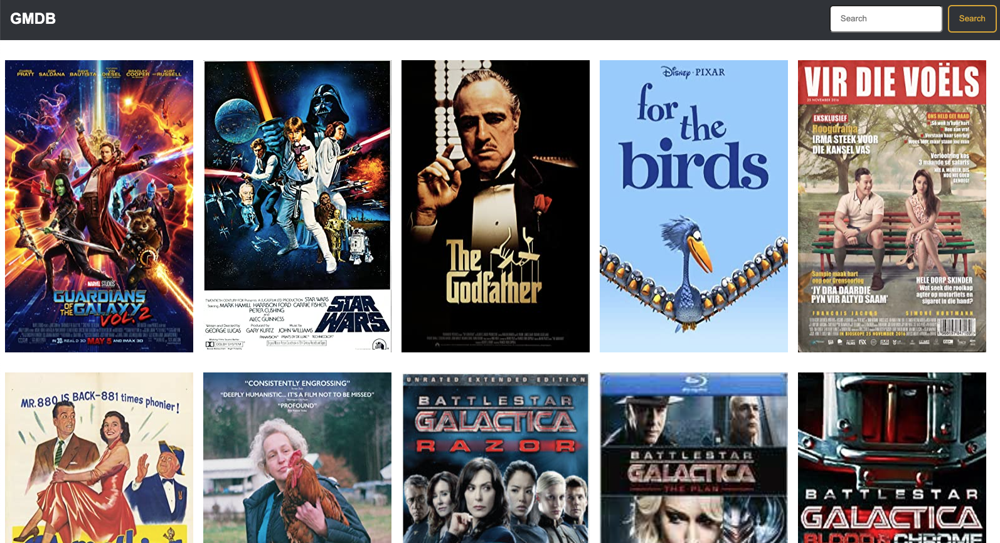
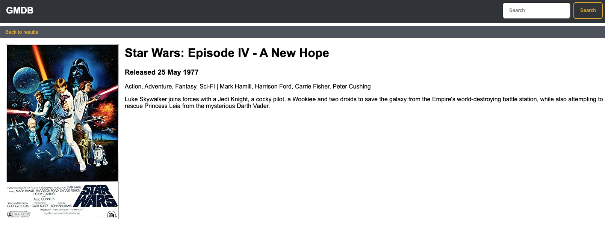
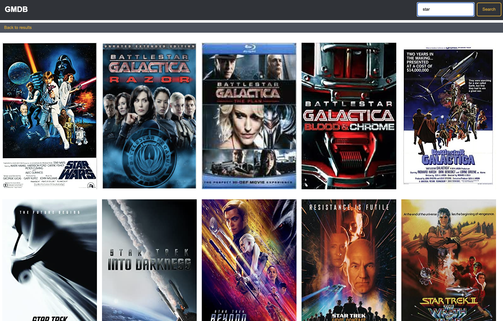

# TDD React Weekly Activity - Build GMDB Front End

## Objectives
    - Test Drive a connected CRUD React app using the relevant testing libraries (Cypress, Jest)

## Background
You are creating your very own movie database (definitely not IMDB). You have been given some designs and feature requests of what a Minimum Viable Product should look like, and it's your responsibility to create your own user stories and work flow.

### Features:
- Browse movies
- Look at a specific movie with details and reviews
- Search movies

### Designs:
- Browsing Movies

- Movie Details and Reviews

- Searching for movies

## Acceptance Criteria
- All code is produced through TDD with a pair
- UI tests are performed using Cypress
- All functionality of the application is developed using component based architecture in React
- All persistent data is received and processed through network requests to the back end service
- The application is structured to consume data according to the structure provided by the back end service

## Instructions

### Server Setup:
- fork and clone this repo using git
- to install the back end service and dependencies, run `npm install` in the root of the `server/` directory
- To start the server, run `npm run start`
- The server will be available at `http://localhost:3001`

#### Available Service Endpoints
- `GET movies` - returns a list of all movies
- `GET movies/:id` - returns details of a specific movie
- `GET movies?search=<query>` - returns a list of movies filtered on titles matching the given query

### Front End Setup:
In a new directory
- run `npx create-react-app gmdb-frontend` to generate a new project
- In your command line, navigate to the generated project
- to install Cypress, run `npm install --save-dev cypress @testing-library/cypress`
- install and setup React Testing Library [following this link](https://testing-library.com/docs/react-testing-library/intro/)
- to test your app using React Testing Library and Jest, run `npm run test`
- to test your app using Cypress, run `npx cypress open`
- to run your app, run `npm run start`
- - The server will be available at `http://localhost:3000`
